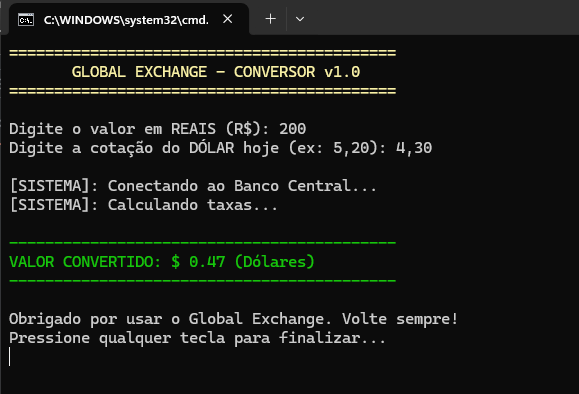

# ConversorExpert

## Descrição
Este projeto foi desenvolvido em .NET com o objetivo de simular um sistema completo de conversão de moedas, aplicando boas práticas de usabilidade e tratamento de erros.

A aplicação recebe um valor em reais, realiza a conversão para dólar e exibe mensagens informativas ao usuário durante todo o processo.

## Objetivo
Demonstrar a aplicação de múltiplos conceitos de usabilidade, incluindo visibilidade do status, prevenção de erros e exibição de informações claras ao usuário.

## Conceitos Aplicados

- Visibilidade do Status do Sistema  
O sistema informa ao usuário cada etapa do processo, como conexão, processamento e finalização.

- Prevenção de Erros  
O sistema utiliza tratamento de exceções para lidar com entradas inválidas.

- Estética e Design Minimalista  
As informações são exibidas de forma clara, organizada e objetiva.

## Estrutura do Projeto
- Program.cs: Contém toda a lógica do sistema, incluindo entrada de dados, conversão e tratamento de erros.

## Exemplo de Execução

## Conclusão
A aplicação demonstra como diferentes heurísticas de usabilidade podem ser aplicadas em conjunto para criar uma experiência mais clara, segura e eficiente para o usuário.
